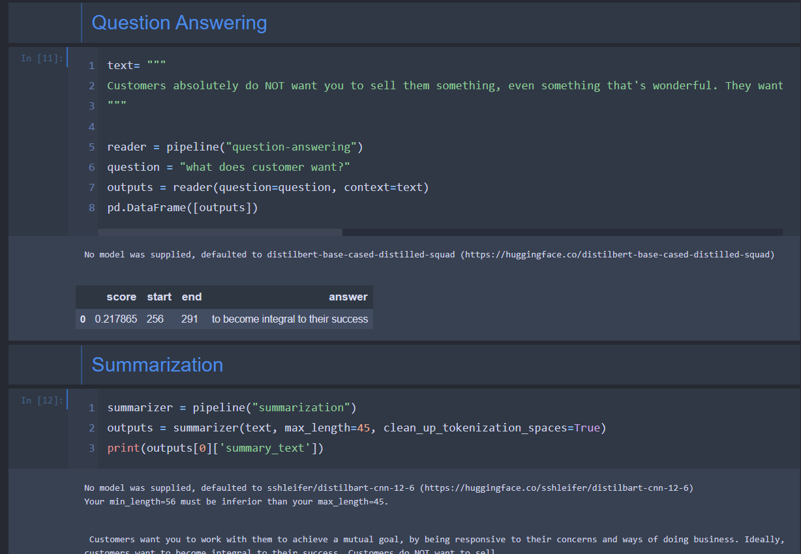

# Hello transformers

In 2017, researchers at Google published a paper that proposed a novel neural network
architecture for sequence modeling. Dubbed the Transformer, this architecture outperformed
recurrent neural networks (RNNs) - Attention is all you need

an effective transfer learning method called ULMFiT showed that training long
short-term memory (LSTM) networks on a very large and diverse corpus could produce stateof-the-art text classifiers with little labeled data.

These advances were the catalysts for two of today’s most well-known transformers: the
Generative Pretrained Transformer (GPT) and Bidirectional Encoder Representations from
Transformers (BERT)

## Encoder Decoder Framework

These architectures contain a feedback loop in the network connections that allows information
to propagate from one step to another, making them ideal for modeling sequential data like text.
As illustrated on the left side of Figure 1-2, an RNN receives some input (which could be a
word or character), feeds it through the network, and outputs a vector called the hidden state

Good blog for reference
http://karpathy.github.io/2015/05/21/rnn-effectiveness/

## Attention mechanism

This is where attention comes in: it lets
the decoder assign a different amount of weight, or “attention,” to each of the encoder states at
every decoding timestep. T

With the transformer, a new modeling paradigm was introduced: dispense with recurrence
altogether, and instead rely entirely on a special form of attention called self-attention. We’ll
cover self-attention in more detail in Chapter 3, but the basic idea is to allow attention to
operate on all the states in the same layer of the neural network.

## transfer learning

framework to adapt pretrained LSTM models for various tasks.
ULMFiT involves three main steps:
Pretraining
The initial training objective is quite simple: predict the next word based on the previous
words. This task is referred to as language modeling. The elegance of this approach lies in
8
9
the fact that no labeled data is required, and one can make use of abundantly available text
from sources such as Wikipedia.
Domain adaptation
Once the language model is pretrained on a large-scale corpus, the next step is to adapt it to
the in-domain corpus (e.g., from Wikipedia to the IMDb corpus of movie reviews, as in). This stage still uses language modeling, but now the model has to predict the

next word in the target corpus.
Fine-tuning
In this step, the language model is fine-tuned with a classification layer for the target task
(e.g., classifying the sentiment of movie reviews).

for transfer learning ulm fit was used.

## Introduction of Hugging Face transformers

We looked at all sort of transformations using hugging face.

## The hugging face ecosystem
As outlined earlier, transfer learning is one of the key factors driving the success of
transformers because it makes it possible to reuse pretrained models for new tasks.
Consequently, it is crucial to be able to load pretrained models quickly and run experiments
with them.
The Hugging Face Hub hosts over 20,000 freely available models. As shown in Figure 1-10,
there are filters for tasks, frameworks, datasets, and more that are designed to help you navigate
the Hub and quickly find promising candidates. As we’ve seen with the pipelines, loading a
promising model in your code is then literally just one line of code away. This makes
experimenting with a wide range of models simple, and allows you to focus on the domainspecific parts of your project

## Hugging face tokenizers

Tokenizers provides many tokenization strategies and is extremely fast at tokenizing text
thanks to its Rust backend. It also takes care of all the pre- and postprocessing steps, such as
normalizing the inputs and transforming the model outputs to the required format. With 
Tokenizers, we can load a tokenizer in the same way we can load pretrained model weights
with Transformers.

## Hugging face dataset

simplifies this process by providing a standard interface for thousands of datasets
that can be found on the Hub. It also provides smart caching (so you don’t have to redo your
preprocessing each time you run your code) and avoids RAM limitations by leveraging a
special mechanism called memory mapping that stores the contents of a file in virtual memory
and enables multiple processes to modify a file more efficiently. The library is also
interoperable with popular frameworks like Pandas and NumPy, so you don’t have to leave the
comfort of your favorite data wrangling tools.
Having a good dataset and powerful model is worthless, however, if you can’t reliably measure
the performance. Unfortunately, classic NLP metrics come with many different
implementations that can vary slightly and lead to deceptive results. By providing the scripts
for many metrics, Datasets helps make experiments more reproducible and the results more
trustworthy.
With the Transformers, Tokenizers, and Datasets libraries we have everything we
need to train our very own transformer models! However, as we’ll see in Chapter 10 there are
situations where we need fine-grained control over the training loop. That’s where the last
library of the ecosystem comes into play: Accelerate.

## Hugging face Accelerate

simplifies this process by providing a standard interface for thousands of datasets
that can be found on the Hub. It also provides smart caching (so you don’t have to redo your
preprocessing each time you run your code) and avoids RAM limitations by leveraging a
special mechanism called memory mapping that stores the contents of a file in virtual memory
and enables multiple processes to modify a file more efficiently. The library is also
interoperable with popular frameworks like Pandas and NumPy, so you don’t have to leave the
comfort of your favorite data wrangling tools.
Having a good dataset and powerful model is worthless, however, if you can’t reliably measure
the performance. Unfortunately, classic NLP metrics come with many different
implementations that can vary slightly and lead to deceptive results. By providing the scripts
for many metrics, Datasets helps make experiments more reproducible and the results more
trustworthy.
With the Transformers, Tokenizers, and Datasets libraries we have everything we
need to train our very own transformer models! However, as we’ll see in Chapter 10 there are
situations where we need fine-grained control over the training loop. That’s where the last
library of the ecosystem comes into play: Accelerate.

